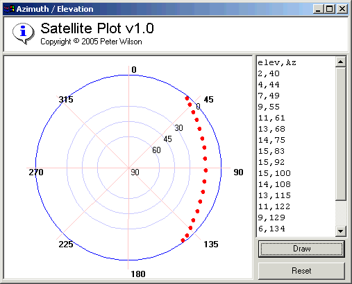



## Satellite Plotter v1\.0 \(user control\)

### Description

Plots the Azimuth and Elevation of a satellite on a UserControl. This project was the result of a request from Fred in Mosta. Hey Fred! did you know I actually work as a Satellite Tracker? or is this just a crazy coincidence that you asked me to create this? The plot I've created here is very similar to the style we use at work (although this one looks better), however there are only so many ways you can do this, so I guess they all look like similar.
 
### More Info
 

             |
---                |---
**Submitted On**   |2005-07-06 10:20:08
**By**             |[Peter Wilson](https://github.com/Planet-Source-Code/PSCIndex/blob/master/ByAuthor/peter-wilson.md)
**Level**          |Beginner
**User Rating**    |4.3 (13 globes from 3 users)
**Compatibility**  |VB 6\.0
**Category**       |[Graphics](https://github.com/Planet-Source-Code/PSCIndex/blob/master/ByCategory/graphics__1-46.md)
**World**          |[Visual Basic](https://github.com/Planet-Source-Code/PSCIndex/blob/master/ByWorld/visual-basic.md)
**Archive File**   |[Satellite\_190977762005\.zip](https://github.com/Planet-Source-Code/peter-wilson-satellite-plotter-v1-0-user-control__1-61553/archive/master.zip)

